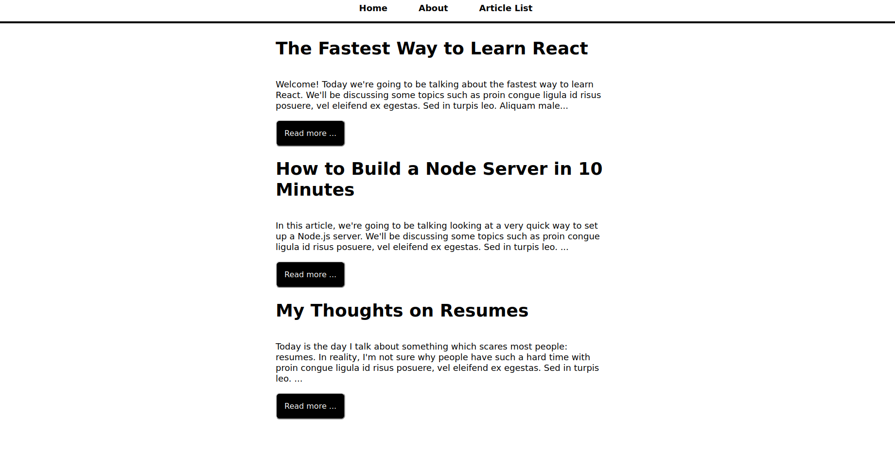
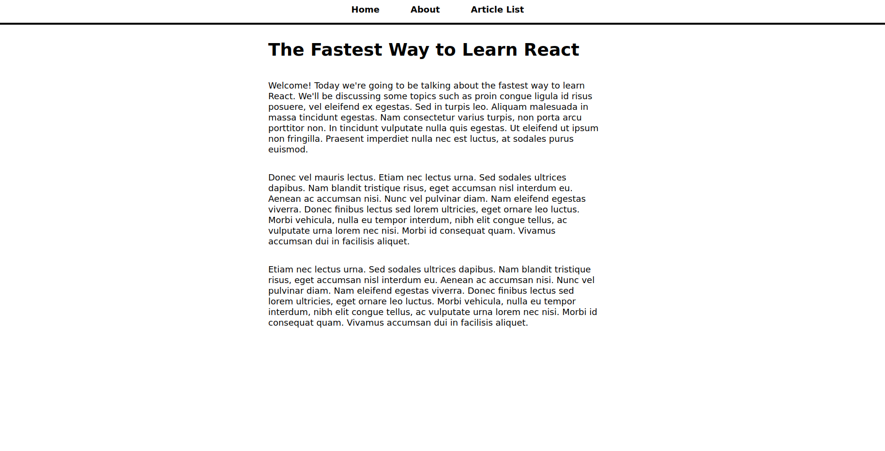

# REACT Simple Blog Site

> A simple blog site made with react

   
   
   
   
   

## Watch the Live Version

[Live Demo](/#)

## ScreenShots

### Prerequisites

- JavaScript ES6
- React
- NodeJS
- Code Editor(VScode)

### Usage

1. Clone the reposatory by using the `git clone git@github.com:widzthedvloper/my-blog.git` command in your terminal
2. `cd` into the clone reposatory
3. Open the code base using any code editor or your choice, preferably "visual studio code editor"
4. Open the vscode terminal and run the application by typing `npm start` and hit enter.

## Contributing

This project was created for educational purposes

👤 **Widzmarc Jean Nesly Phelle**

- GitHub: [@widzthedvloper](https://github.com/widzthedvloper)
- Twitter - [@widzthedvloper](https://twitter.com/widzthedvloper)
- LinkedIn: [@widzthedvloper](https://www.linkedin.com/in/widzmarc-jean-nesly-phelle-252a26129/)

### Show your support

Give a ⭐️ if you like this project!

## License

This project is licensed under the MIT License
